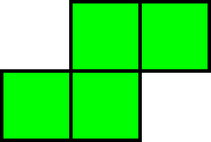
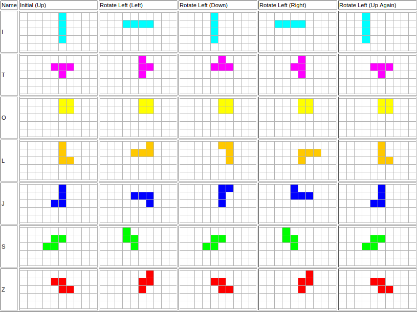

# Project: Tetris Game

# Overview
In this project, I implemented code for the Tetris game. 

# Tetromino
A tetromino is a game piece that can have one of seven shapes, each with a distinct color as shown in the table below.

| Tetromino/Piece    | Shape  | Color |
|:------------------:|:------:|:-----:|
|I                   ||Cyan|
|J                   ||Blue|
|L                   ||Orange|
|O                   ||Yellow|
|S                   ||Green|
|T                   ||Purple|
|Z                   ||Red|

## Layout and Rotation
The layout of a tetromino represents its shape. When a tetromino rotates, its layout changes. Each tetromino has 4 layouts: up, left, down and right. When originally created, a tetromino is in the **up** layout. After one left rotation, it shifts to the **left** layout. After a second left rotation, it shifts to the **down** layout. After a third left rotation, it shifts to the **right** layout. Finally, after a fourth left rotation, it returns to a **up** layout. This sequence can be repeated by pressing z during game play. After going from the up layout to the up layout again, i.e in one full rotation through each 90 degree phase, all tetromino's except from the I tetromino should occupy the same column coordinate as they did initially (If they have been moved down in during the rotation, their row coordinate may have changed). The I tetromino, however, should move left by one position after one complete counter-clockwise rotation. Therefore, the "rotation" of a I tetromino is really a translation, with each full rotation moving it one column closer to the left of the game board.

The diagram below shows the progression of each tetromino as you rotate counter-clockwise by 90 degrees.

## Location
Although the layout of a tetromino is set (because its shape is set) for each of the 4 possible orientations, the location of a layed out tetromino will change due to rotation and moving the tetromino left/right. The diagram below illustrates this for the I tetromino.

## Initial Positions
So the inital position of each piece is relative to the size of the board.
One way to think about it is, there is a desginanted spot on each piece which 
is to be placed in the center of the board and the rest of the piece is to built
 around that. The center of the board is always at index Floor(MaxCols / 2).

Here is an example for a game board that has 10 columns:

The black square represents the column that is index Floor(10 / 2) *(ie 5)*

# Game Play
A random sequence of Tetrominos will fall down the playing field from the centre. The goal of the game is to fill the gaps horizontally. When an entire row is filled, the rows above it will collapse down by one row. A player can move a tetromino left/right using the corresponding arrow keys. They can also rotate the  tetromino left (counter-clockwise) 90 degrees at a time by pressing the z key.

Some things to note are:
* When a tetromino is moved left/right or rotated, the destination cells must be empty.
* Although the size of the  game board is 22 rows and 10 columns, your implementation should not depend on this (it would be a bad idea to hard code these numbers anywhere in your code). It should work correctly even if those dimensions are changed.
* Take note of where each tetromino is inserted into the board. This can be done by going through the public tests, however usually the heuristic is top left square of each piece is placed in the center of the board. 
* The game ends when a new piece cannot be placed onto the board. 

